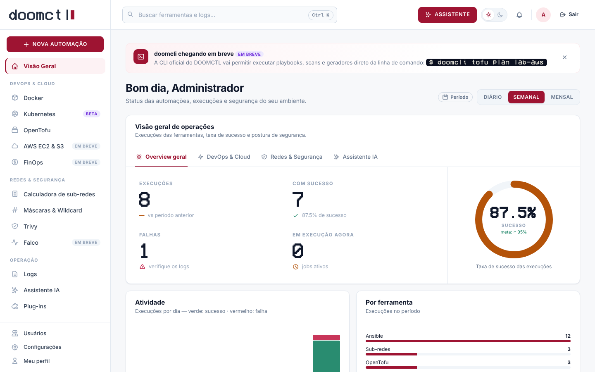
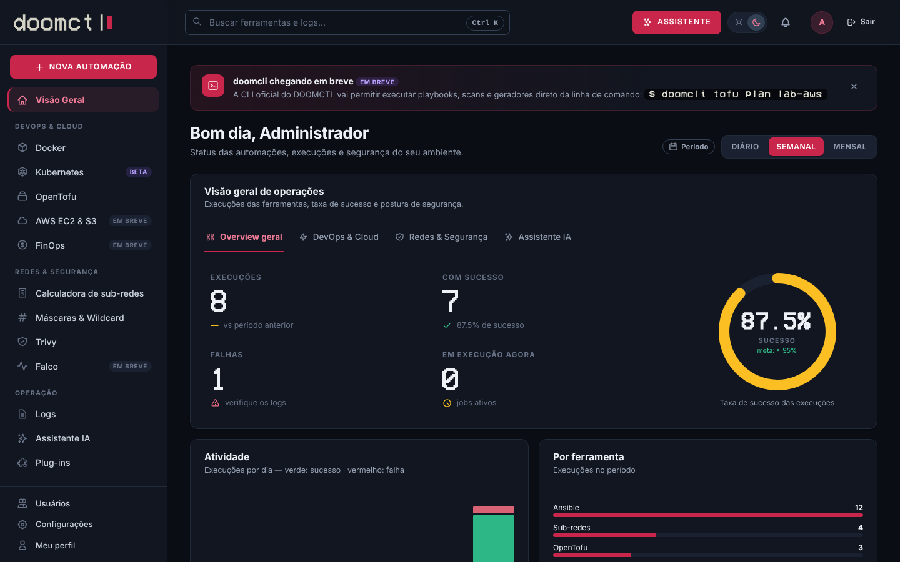
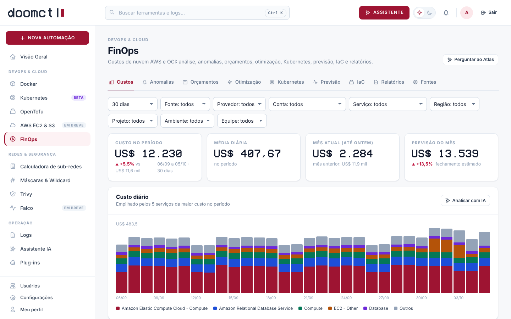
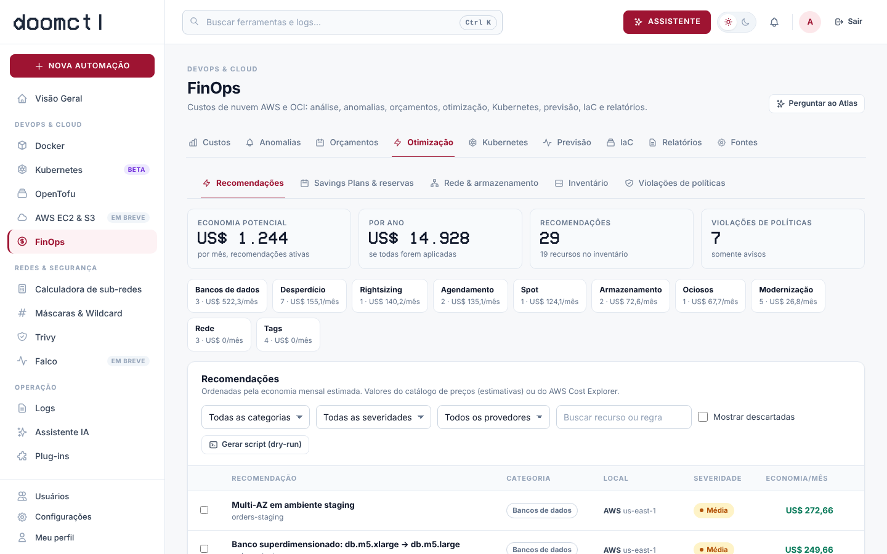
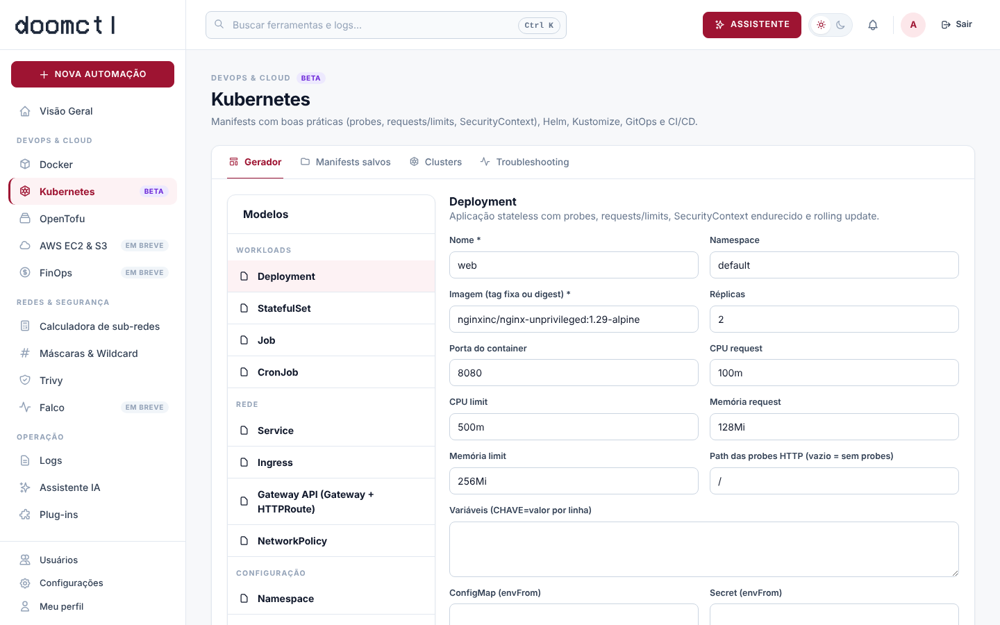
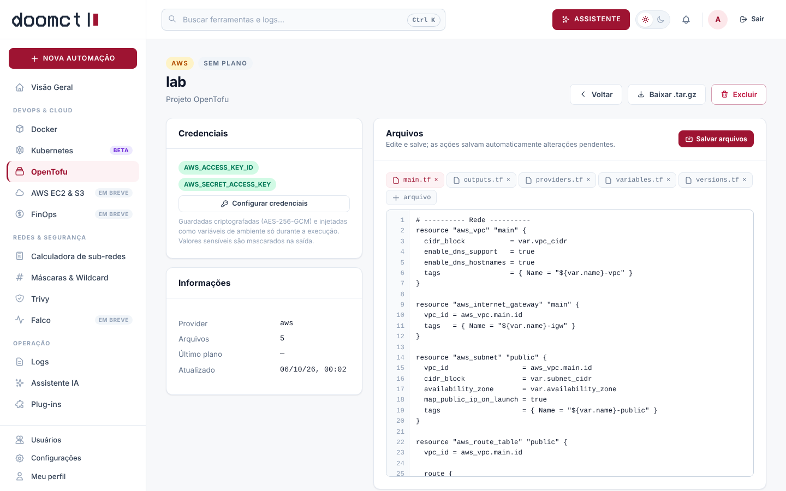
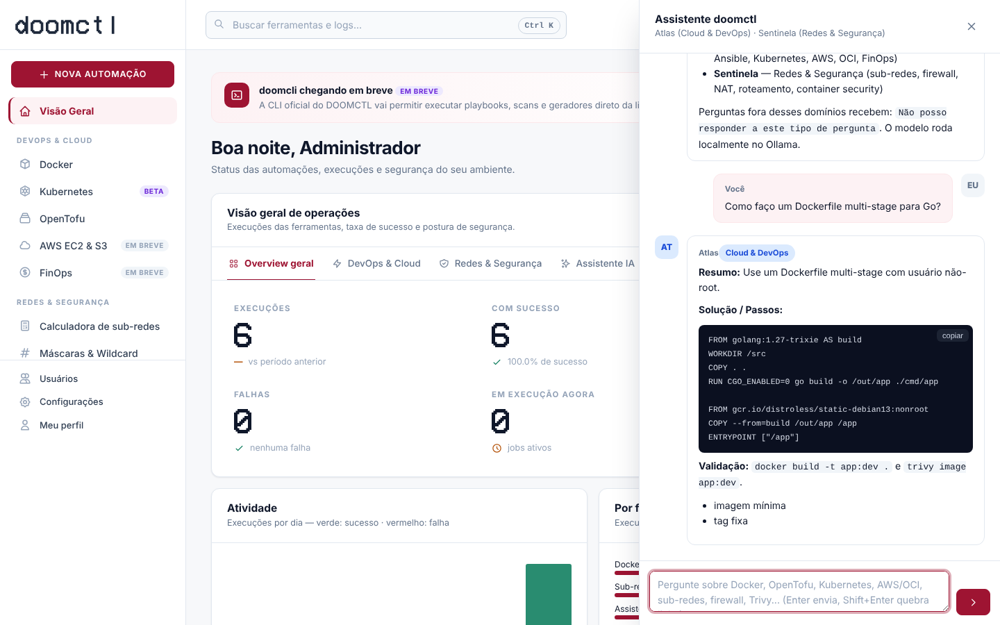
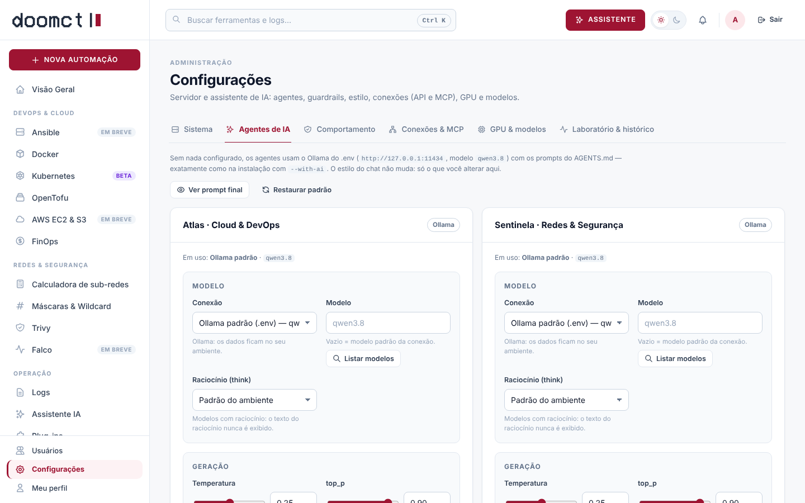
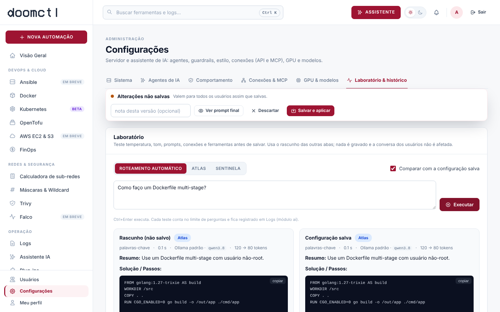
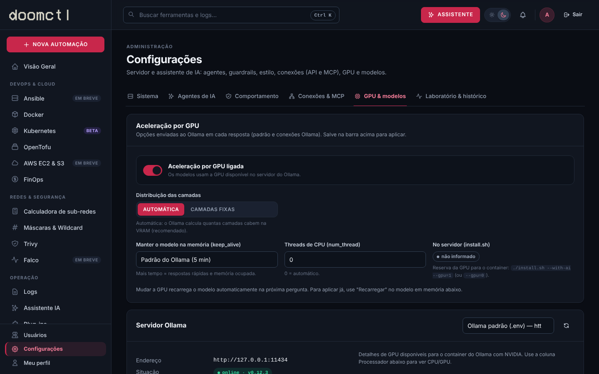

<p align="center">
  <picture>
    <source media="(prefers-color-scheme: dark)" srcset="docs/logo-dark.svg">
    
  </picture>
</p>

<p align="center">
  <b>Ferramentas DevOps & Cloud e Redes & Segurança, self-hosted, com assistentes de IA locais.</b><br>
  Go 1.27 · PostgreSQL 18 · Debian trixie · Ollama
</p>

<p align="center">
  <a href="#-início-rápido">Início rápido</a> ·
  <a href="#-funcionalidades">Funcionalidades</a> ·
  <a href="DOCUMENTATION.md">Documentação</a> ·
  <a href="#-segurança">Segurança</a>
</p>

---

O **doomctl** é uma plataforma web para rodar na sua LAN (o *doomctl master*) que gera e executa artefatos de infraestrutura — Dockerfiles, docker-compose, projetos OpenTofu, manifests Kubernetes — além de FinOps para AWS e OCI, calculadora de sub-redes, scans com Trivy e um assistente de IA local que roteia cada pergunta para o especialista certo. Interface responsiva (desktop e mobile), tema claro/escuro, perfis de acesso por módulo e MFA.

<p align="center">
  
  
</p>

> 🚧 **`doomcli`** — a CLI do DOOMCTL — será lançada em breve.

## ✨ Funcionalidades

**DevOps & Cloud**
- **Docker** — gerador de Dockerfile (multi-stage, não-root, healthcheck, formato exec) e docker-compose (registries, volumes com `driver_opts`, redes bridge/macvlan/ipvlan com IPAM, limites, hardening); validação com `docker compose config`; login no Docker Hub e registries privados.
- **Kubernetes** *(beta)* — 23 modelos: Deployment, StatefulSet, Job/CronJob, Service, Ingress, Gateway API, NetworkPolicy, Namespace + Pod Security, ConfigMap/Secret, PV/PVC, RBAC, ServiceAccount, HPA, PDB, Helm Chart, Kustomize, ServiceMonitor/PrometheusRule, pipelines CI/CD (build → Trivy → registry → deploy), Argo CD/Flux e runbook de rollback. Console `kubectl` restrito, `diff`/`apply --dry-run=server` e scan do cluster.
- **OpenTofu** — gerador para **AWS** (VPC, EC2 com IMDSv2, S3 com Block Public Access) e **OCI** (VCN, Compute Flex, Block Volume); credenciais criptografadas; `init → validate → plan → apply` com plano salvo e `destroy` com confirmação.
- **Ansible** — interface web *em breve*; inventário (manual/CSV), `ansible-vault` nativo, playbooks, roles, lint, execução e ad-hoc já disponíveis via API (ver documentação).
- **FinOps** — custos de **AWS** (Cost Explorer) e **OCI** (Usage API) ou CSV: breakdown por conta/serviço/região/projeto/ambiente/equipe, anomalias com alertas por webhook, orçamentos com previsão, rightsizing/ociosos/desperdício, Savings Plans, custo de **Kubernetes** por namespace/workload, previsão, what-if e cenários (AWS × OCI, regiões), **estimativa de custo de OpenTofu** com `doomctl cost-check` para bloquear PRs caros, políticas de custo, remediação automatizada (dry-run) e relatórios showback/chargeback.
- AWS EC2 & S3 via IAM — *em breve*.

**Redes & Segurança**
- **Calculadora de sub-redes** em Go — IPv4/IPv6, divisão, VLSM, utilizáveis na AWS/OCI.
- **Máscaras & wildcard** — tabela /0–/32.
- **Trivy** — CVEs, segredos, misconfigurações de IaC e SBOM (CycloneDX/SPDX).
- Falco (agente remoto) — *em breve*.

**Operação**
- **Assistente de IA** local (Ollama): **Atlas** (Cloud & DevOps) e **Sentinela** (Redes & Segurança), roteamento por heurística + classificador, guardrails anti-alucinação e recusa fora de escopo. Botões *Revisar com IA* nos geradores.
- **Agentes configuráveis pelo navegador**: modelo, temperatura, guardrails, limites, tom, estilo e personas em Markdown; conexões com **Azure OpenAI / Microsoft Foundry** (modelos e agentes), OpenAI, Gemini e APIs compatíveis; ferramentas **MCP** (ex.: Google Stitch, Microsoft Learn, GitHub); laboratório para testar antes de salvar, versões e uso. **Aceleração por GPU** no navegador e no `install.sh --gpu=1|0`.
- **Logs** de todas as execuções, separados por ferramenta, com streaming ao vivo e artefatos.
- **Plug-ins**: Portainer Server CE com um clique.
- **Acesso**: Administrador, Operador e Visualizador; matriz ler/gerenciar por módulo; **MFA TOTP** (Microsoft/Google Authenticator e outros) com exigência controlada pelo administrador.

<p align="center">
  
  
</p>

<p align="center">
  
  
  
</p>

<p align="center">
  
  
  
</p>

## 🚀 Início rápido

Requisitos: Linux com Docker Engine 24+ e o plugin `docker compose`.

```bash
git clone https://github.com/<sua-org>/doomctl.git
cd doomctl
./install.sh              # gera .env com segredos, constrói e sobe
# ou: ./install.sh --with-ai           (inclui Ollama em container e baixa o modelo)
# ou: ./install.sh --with-ai --gpu=1   (idem, com GPU NVIDIA/AMD; --gpu=0 desliga)
```

Acesse `https://<ip-do-servidor>:8443` com o usuário `admin` e a senha temporária mostrada ao final (troca obrigatória no primeiro acesso). Depois ative o MFA em **Meu perfil**.

Instalação manual:

```bash
cp .env.example .env
# defina POSTGRES_PASSWORD e DOOMCTL_SECRET_KEY (openssl rand -base64 32)
docker compose up -d --build
docker compose logs doomctl | grep -A1 "administrador inicial"
```

| Serviço | Porta |
|---|---|
| doomctl (HTTPS, certificado autoassinado por padrão) | 8443 |
| Portainer CE (quando instalado) | 9443 |
| Ollama (perfil `ai`, rede interna) | 11434 |

Variáveis, TLS com certificado próprio, proxy reverso, Ollama externo/GPU, backup e troubleshooting: **[DOCUMENTATION.md](DOCUMENTATION.md)**.

## 🧱 Stack

| Camada | Tecnologia |
|---|---|
| Backend | Go 1.27 (stdlib + `lib/pq` + `go-qrcode`, vendorizados) |
| Frontend | JavaScript puro (ES modules), sem CDN, embutido no binário |
| Banco | PostgreSQL 18 |
| Runtime | Debian 13 (trixie) — ansible, ansible-lint, OpenTofu 1.13, Trivy 0.75, kubectl 1.37, docker CLI + compose |
| IA | Ollama (modelo padrão `qwen3.8`), router em Go; conexões opcionais com APIs compatíveis com OpenAI, Microsoft Foundry e servidores MCP |

```
cmd/            doomctl (servidor e `doomctl cost-check`) e devops-router (CLI de IA)
internal/       agents, finops, gen (geradores), jobs, netcalc, rbac, secure, server, store
web/static/     SPA
docs/           especificação, logo e screenshots
```

## 🔐 Segurança

PBKDF2-SHA256, MFA TOTP com anti-replay, sessões `HttpOnly`/`SameSite=Strict` + CSRF, CSP restritiva, segredos em AES-256-GCM, vaults no formato do `ansible-vault`, execuções sem shell e com ambiente filtrado, container sem root e sem capabilities, downloads de ferramentas verificados por SHA-256.

No FinOps, use credenciais de nuvem **somente leitura** (política IAM mínima na documentação); a remediação automatizada é opcional e habilitada apenas por administradores.

Atenção: permissão de **gerenciar** Ansible/OpenTofu/Kubernetes equivale a executar código no servidor, e o socket do Docker montado equivale a root no host. Detalhes em [DOCUMENTATION.md § Segurança](DOCUMENTATION.md#13-segurança).

## 🛠️ Desenvolvimento

```bash
make test     # testes unitários (RFC 6238, SigV4, assinatura OCI, FinOps, router de IA, geradores validados com PyYAML, RBAC)
make build    # bin/doomctl e bin/devops-router
make run      # requer PostgreSQL e DOOMCTL_DATABASE_URL
```

## 🗺️ Roadmap

- [ ] `doomcli` — CLI do DOOMCTL
- [ ] Interface web do Ansible
- [ ] Agentes remotos via WebSocket (Falco)
- [ ] AWS EC2 & S3 via IAM
- [x] FinOps (custos AWS/OCI, anomalias, orçamentos, rightsizing, Kubernetes, forecasting, IaC cost estimation, CI/CD)
- [ ] FinOps: inventário automático da OCI e Azure/GCP via API
- [ ] SSO (OIDC/LDAP)

## 📄 Licenças

Código: defina a licença do projeto (ex.: MIT ou Apache-2.0) adicionando um arquivo `LICENSE`.
Fonte do logo *vhs/vcr osd* (sokXX, baseada em VCR OSD MONO): **CC BY-SA 3.0**. Demais componentes: veja [DOCUMENTATION.md § Licenças](DOCUMENTATION.md#17-licenças-de-terceiros).
